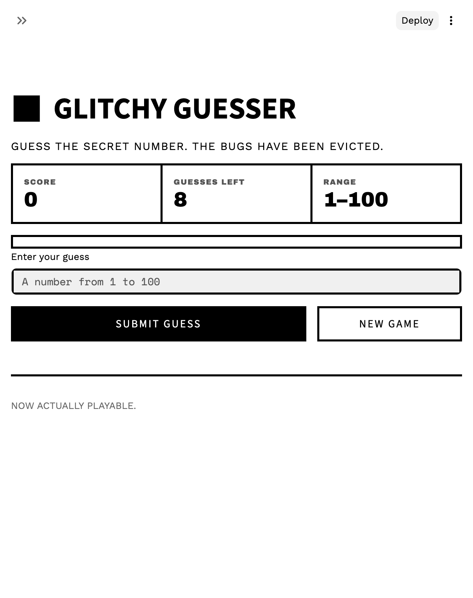

# 🎮 Game Glitch Investigator: The Impossible Guesser

A Streamlit number-guessing game that shipped broken — an AI ("GameGenie") left
bugs that made it unwinnable. This repo documents finding and fixing them.

## 🛠️ Setup

1. `pip install -r requirements.txt`
2. `python -m streamlit run app.py`

## 🕵️‍♂️ Mission

1. Play the game (toggle **Dev mode** in the sidebar to reveal the secret).
2. Find the state bug: why does the secret change on every guess?
3. Fix the wrong "Higher/Lower" hints.
4. Move the logic into `logic_utils.py` and make `pytest` pass.

## 🎯 The Game

The app picks a secret number in a difficulty-based range (Easy 1–20, Normal
1–100, Hard 1–50). You guess until you hit it or run out of attempts. Each guess
gives a "Too High"/"Too Low" hint; attempts and score update as you play; "New
Game" starts a fresh round.

## 🐛 Bugs Found

The three glitches GameGenie left behind:

| # | Bug | Symptom |
|---|-----|---------|
| 1 | Secret regenerated every rerun — `secret_number = random.randint(1, 100)` ran at module level instead of being stored | Number changed on every guess; winning was impossible |
| 2 | Hints inverted — a too-high guess said "Go HIGHER", a too-low one said "Go LOWER" | Hints pointed the wrong way |
| 3 | `check_guess` unimplemented in `logic_utils.py` (returned `"Not Implemented"`) | No reusable win/high/low logic |

## 🔧 Fixes

- **State (#1):** secret stored in `st.session_state.secret`, set once per round in `new_game_state()` ([app.py:153](app.py#L153)).
- **Logic (#2, #3):** `check_guess` returns `"Win"`/`"Too High"`/`"Too Low"` with the correct direction ([logic_utils.py:21](logic_utils.py#L21)).
- **Refactor:** logic moved into `logic_utils.py` (`get_range_for_difficulty`, `parse_guess`, `check_guess`, `update_score`); the inline UI was rewritten into a stateful app with ranges, an attempt limit, scoring, history, and "New Game" ([app.py:152](app.py#L152)).

`parse_guess` rejects decimals — `int("12.9")` raises, so `"12.9"` is refused, not truncated ([logic_utils.py:16](logic_utils.py#L16)). All four helpers are covered by tests.

## 📸 Demo Walkthrough

Sample round (secret = 63):

1. App picks the secret; it stays fixed across guesses.
2. Guess 40 → "Too Low".
3. Guess 70 → "Too High".
4. Guess 60 → "Too Low".
5. After each guess, attempts rise, "Guesses left" falls, and the score updates (−5 per wrong guess).
6. Guess 63 → "Correct!" — game ends.

## 🧪 Test Results

```batch
$ pytest tests/
platform darwin -- Python 3.9.6, pytest-8.4.2, pluggy-1.6.0
collected 11 items

tests/test_game_logic.py ...........                                     [100%]

============================== 11 passed in 0.01s ==============================
```

## 🚀 Stretch: Enhanced UI (Challenge 4)

Rebuilt the UI with the RawBlock brutalist design system — thick borders, zero
radius, no shadows, Archivo Black / Work Sans / Space Mono. See
[DESIGN.md](DESIGN.md).


